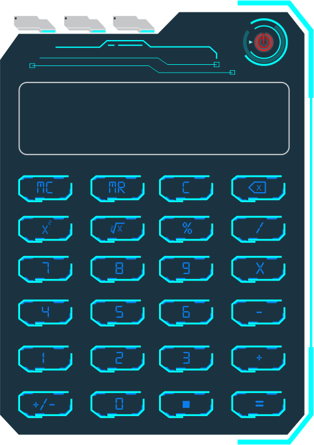
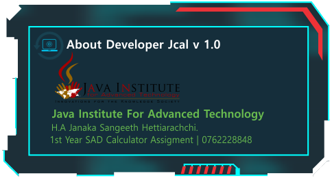
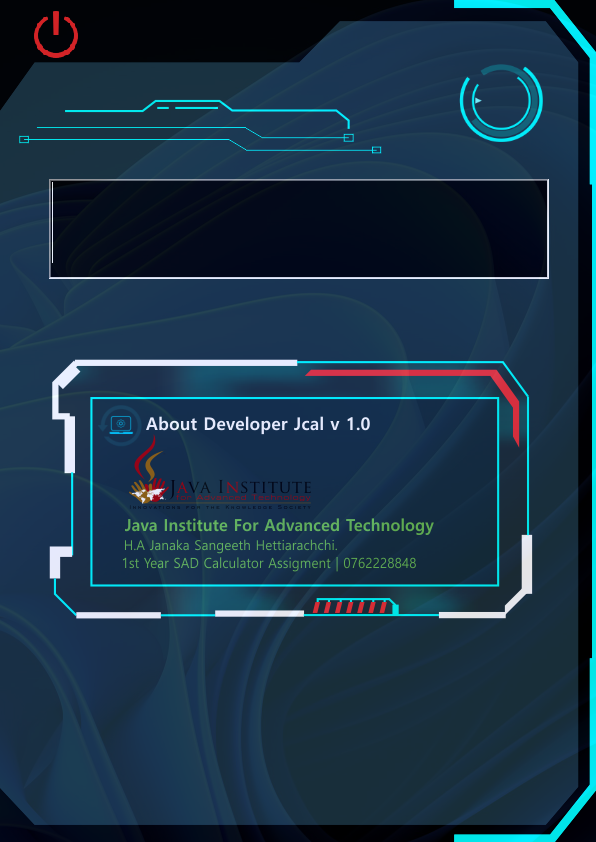

# Java Modern Calculator



## Overview
This project is a visually modern, feature-rich calculator application built in Java using AWT. It provides a beautiful, custom-styled interface with image-based buttons and panels, supporting both basic and some advanced mathematical operations. The project is designed for educational and demonstrative purposes, showcasing custom UI design and event-driven programming in Java.

## Features
- **Modern Custom UI**: Uses PNG images for buttons and panels for a unique look.
- **Basic Operations**: Addition, subtraction, multiplication, division.
- **Advanced Functions**: Square, square root, percentage
- **Animated Elements**: Includes animated UI panels and icons.
- **Menu Bar**: File, Edit, and Help menus with About and Calculator info panels.
- **Responsive Feedback**: Button hover and click effects.

## Screenshots





## How to Build and Run

### Requirements
- Java JDK 8 or higher
- (Optional) NetBeans or any IDE supporting Ant projects

### Build with Ant
1. Open a terminal in the project root directory.
2. Run:
   ```powershell
   ant clean
   ant build
   ant run
   ```
   Or use your IDE's build/run commands.

### Manual Compile/Run
1. Compile:
   ```powershell
   javac -d build/classes src/Cal.java
   ```
2. Run:
   ```powershell
   java -cp build/classes Cal
   ```

## Project Structure
```
Cal.java           # Main calculator source code
src/img/           # UI images for buttons and panels
src/new_ani/       # Animated UI elements
build.xml          # Ant build script
```

## Customization
- To change the UI, replace images in `src/img/` and `src/new_ani/`.
- Edit `Cal.java` to add or modify calculator logic.

## Author
- Name: *Sangeeth*
- Purpose: *Accademic Assingment*
- Institute: *Java Institute For Advance Technology*

## License
This project is for educational use.

---
